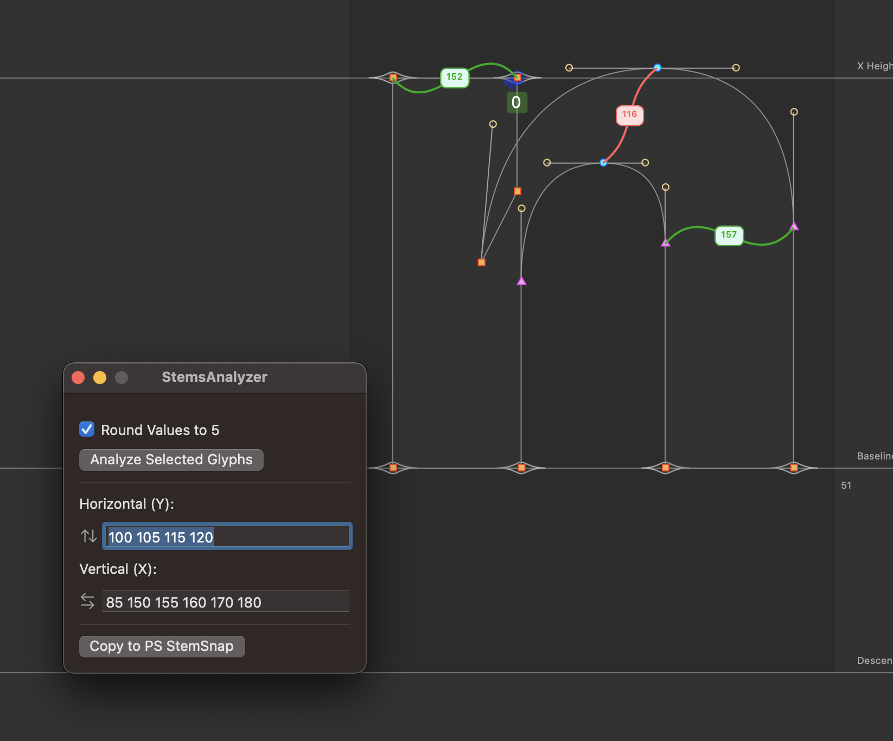

# StemAnalyzer

StemAnalyzer is a RoboFont extension for setting PostScript `stemSnap` values in a UFO. 
To use the extension, select the glyphs you want to analyze and click `Analyze Selected Glyphs`. This will populate the text fields below, you can then set the values into your font's `postscriptStemSnapH` and `postscriptStemSnapV`.
You can also view the stem values in the glyphWindow for each analyzed glyph.

This extension was originally written by [Jérémie Hornus](https://black-foundry.com) and was updated for RoboFont 4 by [Connor Davenport](https://connordavenport.com). All the math has stayed the same, only updates are to the UI and drawing methods.